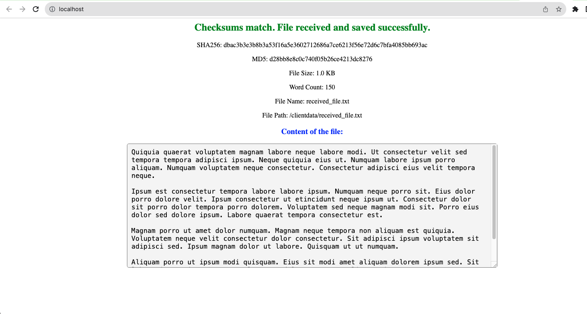
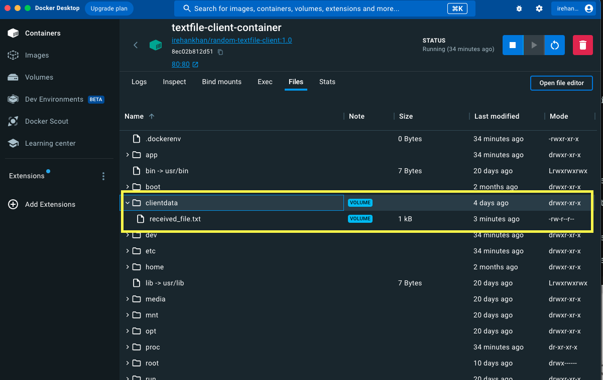
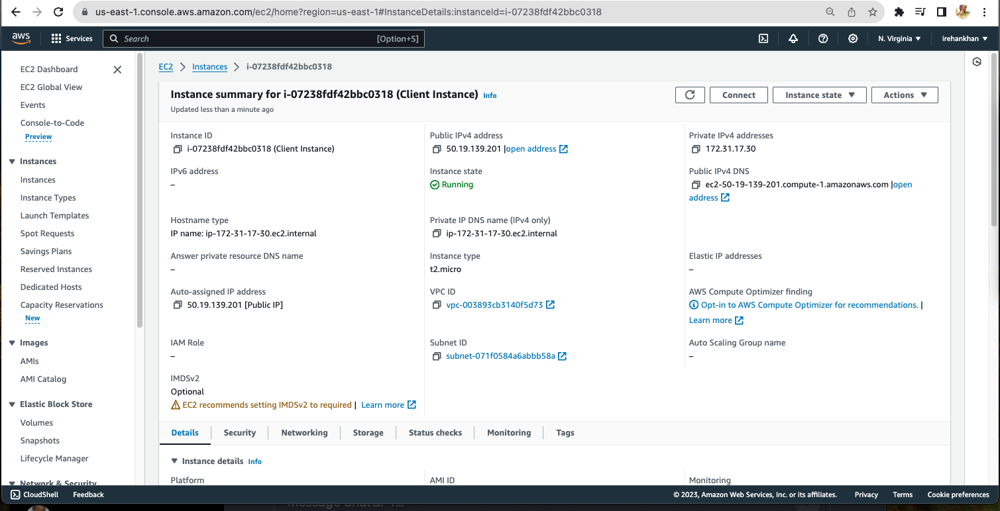
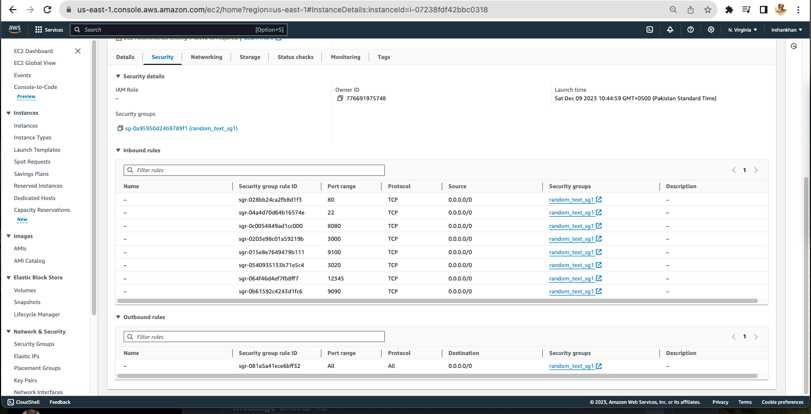
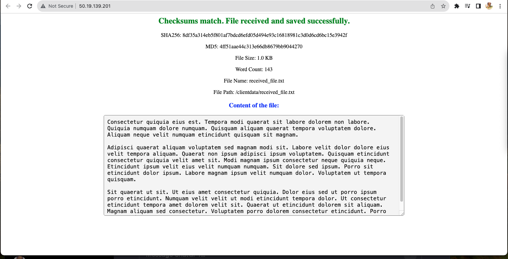
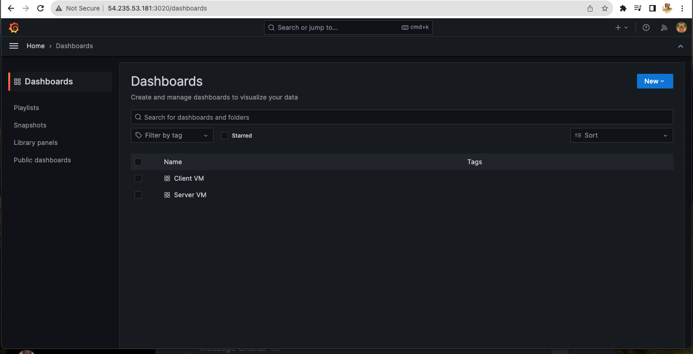
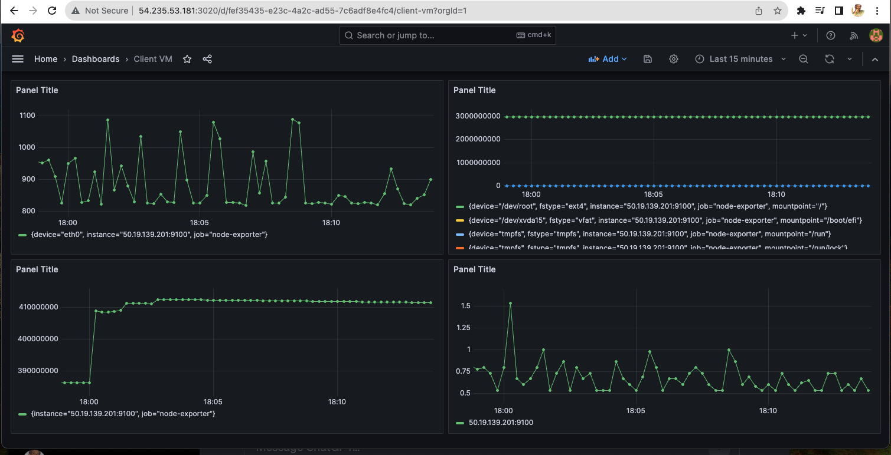
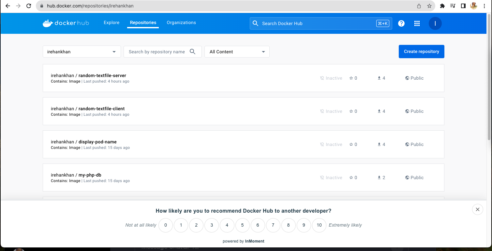
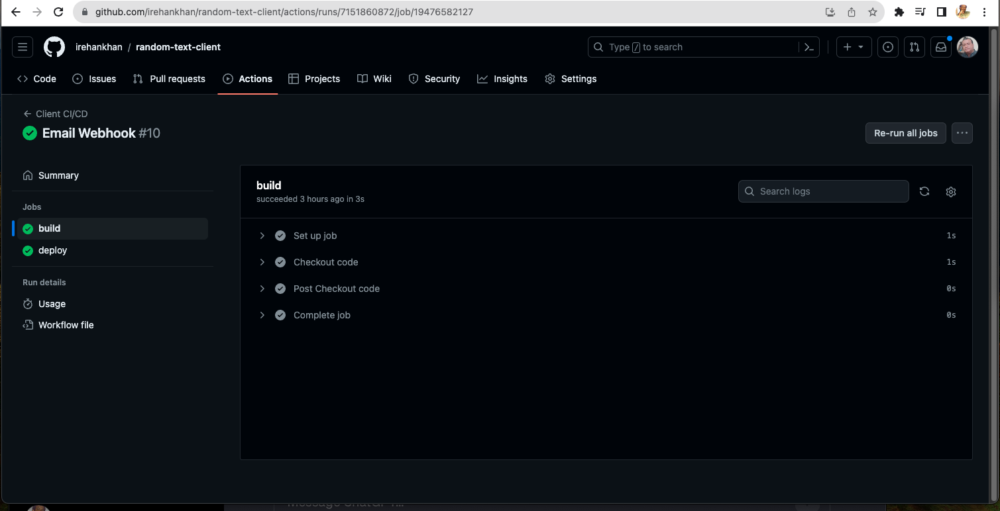
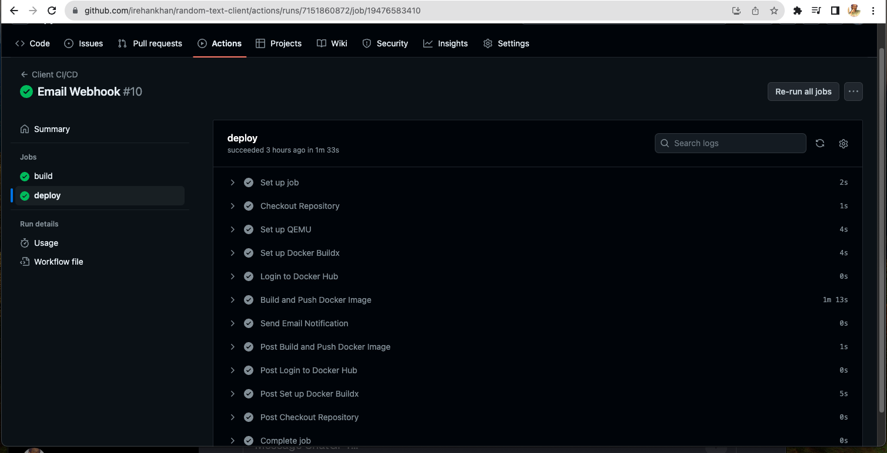

# Random Text Client

## Base Image
-   We will Use `python:3.9-slim` image from Docker Hub

## Dockerfile
```Dockerfile
# Use an official Python runtime as a parent image
FROM python:3.9-slim

# Set the working directory in the container
WORKDIR /app

# Copy the current directory contents into the container at /app
COPY . /app

# Install any needed packages specified in requirements.txt
RUN pip install --no-cache-dir -r requirements.txt

# Create a volume named "servervol" and mount it at "/serverdata" in the container
VOLUME /clientdata

# Run app.py when the container launches
CMD ["python", "./client.py"]
```
-   In above Dockerfile

 - FROM python:3.9-slim:
    - This line sets the base image for your Docker image. It specifies that you want to use the official Python image from the Docker Hub with Python version 3.9, based on the slim variant. The "slim" variant means it includes only essential components, making the resulting image smaller.
 - WORKDIR /app:
    - This sets the working directory inside the container to /app. It means that any subsequent instructions in the Dockerfile will be executed in this directory unless explicitly changed.
 - COPY . /app:
    - This line copies the contents of the current directory (where your Dockerfile is located) into the /app directory within the container. This is how your application code gets transferred into the Docker image.
 - RUN pip install --no-cache-dir -r requirements.txt:
    - This line installs the Python dependencies specified in the requirements.txt file. The --no-cache-dir option is used to avoid caching the downloaded packages, which can be useful to reduce the image size.
 - VOLUME /clientdata:
    - This line creates a volume named "clientdata" and mounts it at the path "/clientdata" within the container. Volumes are used for persisting data outside the container, allowing you to share data between the host and the container or between containers.
 - CMD ["python", "./client.py"]:
    - This sets the default command to be executed when the container starts. It runs the Python script client.py using the Python interpreter. This assumes that client.py is the entry point for your application.

This Dockerfile sets up a Python environment, copies your application code into the container, installs the necessary dependencies, creates a volume for storing client data, and specifies the default command to run your Python script when the container starts.

## Client Application Script

This Python script defines a Flask web application that simulates receiving a file from the server, verifies the file's integrity, and saves it to a specified directory. The script also generates some additional information about the received file, such as checksums, file size, word count, and displays this information in an HTML template.

Let's break down the key components of the script:

- Flask Setup:
    - The script uses the Flask web framework to create a web application.
    @app.route('/'): Defines a route for the root URL ("/"). The associated function (receive_and_save_file) will be executed when a user accesses this route.
- Constants and Configuration:
- DESIRED_FILE_SIZE_BYTES: 
    - Specifies the desired file size in bytes. The script generates a file with random content until it reaches this size.
- File Receiving and Saving Logic:
  - `generate_fixed_size_file()`: Generates random content until the desired file size is reached and returns the content.
  - `calculate_checksum(data)`: Calculates both SHA256 and MD5 checksums for the given data.
  - `receive_and_save_file()`: Simulates receiving a file, calculates checksums, and saves the file to the "/clientdata" directory. It then generates various details about the received file.
- HTML Template Rendering:
  - The `render_template_string` function is used to render an HTML template with dynamic content.
  - The template includes placeholders ({{ ... }}) that will be replaced by actual values when the template is rendered.
  - Information about the received file, such as checksums, file size, word count, file name, and file path, is displayed in the HTML template.
- Additional Functions:
  - `generate_fancy_text()`: Generates random fancy text using the lorem library.
  - `get_word_count(text)`: Returns the word count of the given text.
- Script Execution:
  - `if __name__ == "__main__":`: Ensures that the Flask app is only run when the script is executed directly (not when it's imported as a module).
  - `app.run(...)`: Runs the Flask application with debugging enabled, listening on all network interfaces (host='0.0.0.0') and on port 80.
This script provides a simple web interface for simulating the receipt of a file, checking its integrity, and displaying various details about the received file.

## Docker Compose
```yml
version: '3'
services:
  client:
    build: .
    container_name: textfile-client-container
    image: irehankhan/random-textfile-client:1.0
    ports:
      - "80:80"
    volumes:
      - clientvol:/clientdata
volumes:
  clientvol:
```
-   In above Docker Compose File

This is used to define and manage multi-container Docker applications. It describes the services, networks, and volumes for your application. Let's break down above docker-compose.yaml file:
```yml
version: '3'
```
- services: Defines the services that make up your application.
  - `client`: Specifies a service named "`client.`" This service is built using the current directory (.), and the resulting image is used to create a container.
    - `build`: .: Builds the Docker image from the current directory (where the Dockerfile is located).
    - `container_name: textfile-client-container`: Sets the name of the container to "`textfile-client-container.`"
    - `image: irehankhan/random-textfile-client:1.0`: Specifies the image name and tag to use. It refers to an image with the name "`irehankhan/random-textfile-client`" and version "`1.0.`"
    - ports: - "`80:80`": Maps port 80 from the host to port 80 in the container, allowing external access to the service.
    - `volumes: - clientvol:/clientdata`: Creates a volume named "clientvol" and mounts it at "/clientdata" within the container. This allows data to be persisted even if the container is stopped or removed.

```yml
volumes:
  clientvol:
```
 - `volumes`: Defines named volumes used by services.
    - `clientvol:`: Specifies a named volume named "`clientvol.`" This is used in the `volumes` section of the `client` service.
This docker-compose.yaml file defines a Docker service named "`client`" based on the current directory's Dockerfile. It uses a named volume ("`clientvol`") to persist data in the "`/clientdata`" directory within the container. The service is accessible externally on port 80, and the container is named "`textfile-client-container.`"

## Deploy and Test
```logs
irehankhan@Rehans-Mac-mini client % docker-compose up --build -d
[+] Building 6.4s (9/9) FINISHED                           docker:desktop-linux
 => [client internal] load build definition from Dockerfile                0.0s
 => => transferring dockerfile: 650B                                       0.0s
 => [client internal] load .dockerignore                                   0.0s
 => => transferring context: 2B                                            0.0s
 => [client internal] load metadata for docker.io/library/python:3.9-slim  0.8s
 => [client 1/4] FROM docker.io/library/python:3.9-slim@sha256:65c30624fb  0.0s
 => => resolve docker.io/library/python:3.9-slim@sha256:65c30624fbccb71fe  0.0s
 => [client internal] load build context                                   0.0s
 => => transferring context: 148.03kB                                      0.0s
 => CACHED [client 2/4] WORKDIR /app                                       0.0s
 => [client 3/4] COPY . /app                                               0.5s
 => [client 4/4] RUN pip install --no-cache-dir -r requirements.txt        4.4s
 => [client] exporting to image                                            0.6s 
 => => exporting layers                                                    0.6s 
 => => writing image sha256:1a67b5fbf6de792c52bdafb834945b5b640d93e237113  0.0s 
 => => naming to docker.io/irehankhan/random-textfile-client:1.0           0.0s 
[+] Running 2/2                                                                 
 ✔ Network client_default               Create...                          0.0s 
 ✔ Container textfile-client-container  Started  
```





# Creating VMs, Infra as a Code (IaC)

We will create two AWS EC2 instances (VMs), one for hosting the server container and another for hosting the client container.
We will make sure that the VPC and subnets are appropriately to allow communication between the two EC2 instances. We use tc.micro instance type, which is covered in AWS free tier.
We will use terraform for infrastructure automation. We will place terraform scripts/configuration in the `terraform` directory of both client and server Github repositories.

- aws_key_pair.tf
This Terraform configuration defines an AWS Key Pair resource using the aws_key_pair provider.

- provider.tf
This Terraform configuration file includes configuration blocks for defining the required provider and configuring the AWS provider.

- ec2.tf
This Terraform configuration defines AWS resources for an EC2 instance and a security group. 
The ingress and egress blocks define rules for allowing incoming and outgoing traffic. In this example, rules are defined for ports 80, 12345, 22, 3020, 3000, 9100, 9090, and 8080, allowing traffic from all IP addresses (0.0.0.0/0).

We have to use below commands for applying above configurations.
`terraform init`
`terraform plan`
`terraform apply`





## Deploy and test Application on AWS Instances

You can Check log text file in my repo for complete steps
- Connect Via SSH to Server Instance
- Install Docker
- Install Docker Compose and deploy.
- Install git for clone my repo to test application on instance.
- After that our application will be up and running.



# Setting up Monitoring Stack
- We will create another VM for grafana monitoring of each instance.
- Grafana dashboard will be accessible at port 3020.
- We will create dashboards to view metrics
- For that we have to install prometheus on server and client instance to get metrics.





# Setting up CI/CD pipelines

● Set up CI/CD pipelines for both repositories to ensure the following:
● Images are pushed to a public registry like Docker Hub.


We will run above commands on Client instance
Using your self-hosted runner
```logs 
# Use this YAML in your workflow file for each job
runs-on: self-hosted
```
● Update the image tag in Docker Compose, pull the new image, and deploy it as part of
the CD process.

```yml
version: '3'
services:
  client:
    image: irehankhan/random-textfile-client:1.0
    container_name: textfile-client-container

    ports:
      - "80:80"
    volumes:
      - clientvol:/clientdata
volumes:
  clientvol:

```

● Integrate a Slack webhook (or another app of your choice) for deployment notifications

Please check workflow file.





## Grafana repo
https://github.com/irehankhan/grafana

# Thank You!


